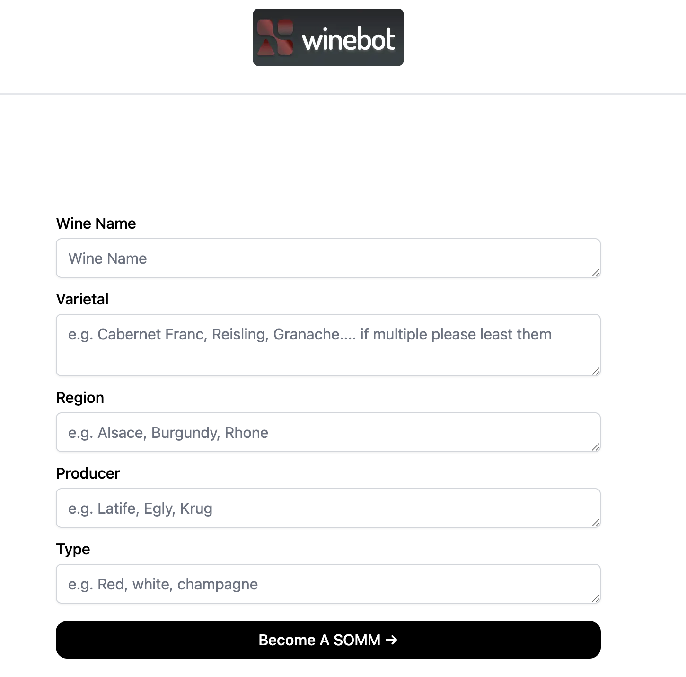

# [AISommelier.app](https://www.aisommelier.app/)

An AI-powered sommelier that helps users discover wines they’ll love — and understand why. Whether you're a curious beginner or an experienced wine lover, AISommelier offers personalized recommendations and educational insights using state-of-the-art AI.

[](https://winesomm.vercel.app/)

---

## 🍷 How It Works

AISommelier uses the [OpenAI ChatGPT API](https://openai.com/api/) combined with [Vercel Edge Functions](https://vercel.com/features/edge-functions) to deliver fast, context-aware recommendations. Here's how it works:

1. The user provides their taste preferences, food pairings, or wine knowledge level.
2. The app generates a prompt and sends it to the ChatGPT API via an edge function.
3. A personalized wine recommendation and educational breakdown is streamed back to the UI in real-time.

It’s like having a sommelier in your pocket.

## Running Locally

After cloning the repo, go to [OpenAI](https://beta.openai.com/account/api-keys) to make an account and put your API key in a file called `.env`.

Then, run the application in the command line and it will be available at `http://localhost:3000`.

```bash
npm run dev
```
